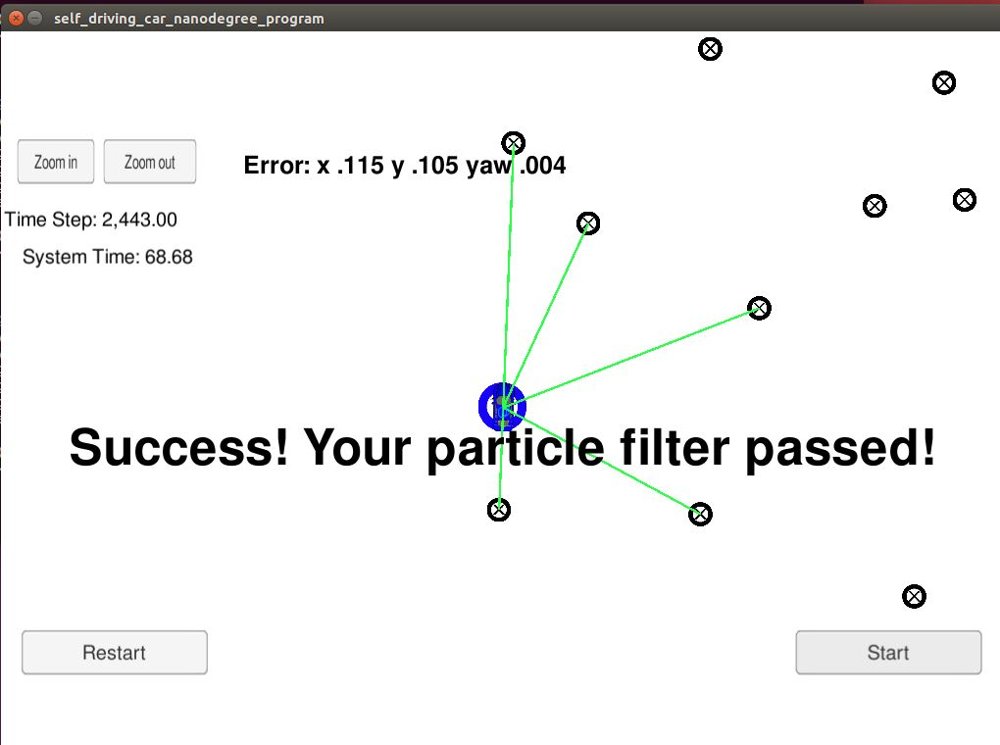

# CarND-Kidnapped-Vehicle-P3
Udacity Self-Driving Car Nanodegree - Kidnapped Vehicle project

## Running the Code
Execute the following in the top directory of the project:

1. ./clean.sh
2. ./build.sh
3. ./run.sh

The final result is as below:  
  

# Implementing the Particle Filter
The directory structure of this repository is as follows:

```
root
|   build.sh
|   clean.sh
|   CMakeLists.txt
|   README.md
|   run.sh
|
|___data
|   |   
|   |   map_data.txt
|   
|   
|___src
    |   helper_functions.h
    |   main.cpp
    |   map.h
    |   particle_filter.cpp
    |   particle_filter.h
```

